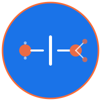

<div align="center">
  
  
  <br/>
  
  

  <br/><br/>

  
  
  
  
  
  
  
  
</div>

# 🌐 AXON — AI eXpress Object Notation

*The Next-Generation™ Paradigm-Shifting™ AI-Native™ Cloud-Scale™ Blockchain-Agnostic™ Data Format*

> **⚠️ Meta-Commentary Alert**: Yes, this is partially satire of the AI bubble. No, the format doesn't actually suck. Yes, every tech bubble uses the same marketing playbook (we literally just did it above with the trademark symbols). No, that doesn't mean useful things don't emerge from the chaos. 
> 
> Welcome to AXON: where we're self-aware enough to mock the hype cycle but stubborn enough to build something that **actually works better than JSON** for LLM workloads. Think of it as "data format with sarcasm" - because if we don't laugh at ourselves, VCs will do it for us when the bubble pops.

## 🚀 Why AXON? (Or: "Why This Bubble Is *Totally* Different™")

### A Brief History of Tech Bubbles We've All Lived Through:

- **2000**: XML will revolutionize everything! *(Then JSON killed it)*
- **2010**: NoSQL is the future! SQL is dead! *(Then everyone went back to Postgres)*  
- **2015**: Blockchain will decentralize the world! *(Still waiting...)*
- **2021**: The Metaverse is inevitable! *(Narrator: It wasn't)*
- **2022**: Web3 will— *(No, it won't)*
- **2024**: **AI will replace all developers!** *(You're still reading this, so...)*

**Now it's AI's turn to ride the hype cycle!** 🎢

But here's the thing about bubbles: they pop, but useful stuff settles at the bottom. The dot-com crash gave us Amazon and Google. The blockchain hype gave us distributed databases people actually use. The AI bubble will probably give us better autocomplete, decent code completion, and some genuinely useful tools buried under mountains of:
- Prompt injection vulnerabilities
- Hallucinations
- "AI-powered" product features that are just regex
- LinkedIn influencers explaining why AGI is 6 months away (always 6 months)
- $200B valuations for companies that lose money on every API call

**AXON is our contribution to that pile**: a format that's legitimately better than JSON for LLM workloads, wrapped in the self-aware sarcasm of engineers who've seen this movie before and know how it ends.

### The Actual Problem (No Really)

Modern AI systems consume data at unprecedented scale. JSON is too verbose (you're literally repeating field names thousands of times). CSV is too ambiguous (good luck with nested data). TOML and YAML are too human-focused. TOON improves token efficiency but struggles with nested structures and implicit typing.

AXON introduces a ~~revolutionary breakthrough paradigm shift~~ reasonably sensible third path: **a format actually designed for passing structured data to token-based systems**.

## ⚡ Built to be (Actually):

- **Ultra-compact** - Schema separation means no repeated field names (unlike JSON's absurd redundancy)
- **Semantically typed** - Explicit types (I, S, F, B, T) so your LLM doesn't confuse "123" the string with 123 the number
- **LLM-aligned** - Consistent delimiters that tokenize predictably (because token boundaries matter more than you think)
- **Enterprise-ready** - Strong schemas for governance (yes, boring compliance stuff actually matters)
- **Human-readable** - You can actually tell what's happening (unlike protobuf)
- **Machine-efficient** - O(n) streaming parser, no multi-pass nonsense

## 🌟 Key Value Propositions (With Realistic Expectations Edition)

### 🔥 Up to 70% reduction in data size*

**The Hype**: 70% smaller than JSON!  
**The Reality**: *30-50% in real-world usage, 70% only if you have absurdly nested data and follow best practices. Your mileage WILL vary based on how badly your schemas are designed, whether you actually understand relational decomposition, and how much legacy JSON you're still wrapping.*

**But Actually Though**: AXON's schema-driven approach eliminates redundant field names (JSON literally repeats `"userId"` a thousand times—that's insane). This means:
- Genuinely faster context loading
- Lower storage footprint (real $$$ savings at scale)
- Reduced API latency
- Fewer tokens = smaller bills from OpenAI/Anthropic

Unlike most "revolutionary" formats, this actually works because the **schema lives separately from the data**. It's not rocket science; it's just good engineering that JSON somehow missed.

### 🧠 Built for LLMs from Day 1 (Not Retrofitted Like Everything Else)

AXON aligns with LLM tokenization patterns:
- Repetitive, consistent delimiters (`|` tokenizes reliably)
- Stable anchor tokens (`@schema`, `@data`) that don't get chunked weirdly
- Type-aware structure (explicit `I:` vs `S:`)
- Relational decomposition instead of nested hell

**This leads to**:
- Higher retrieval accuracy (LLMs parse tables better than nested objects—this is well-documented)
- Lower hallucination rates (structured data = fewer "creative interpretations")
- More predictable prompt behavior (consistency matters for determinism)

**Translation**: Your RAG pipeline might actually work consistently. Novel concept, we know.

### 💸 Significant Cost Savings (Actually, For Real)

Less tokens = 
- Smaller prompts (more fits in context windows)
- Faster inference (fewer tokens to process)
- Cheaper API calls (you pay per token, remember?)
- Better throughput (more requests/second)

**Real talk**: If you're spending $50K+/month on LLM API calls, AXON can actually save you money. Not "blockchain will revolutionize your supply chain" fake savings—actual, measurable, boring, accountant-approved savings. The kind that CFOs care about.

### 🏢 Enterprise-Grade Governance (AKA The Boring Stuff That Matters)

Unlike JSON (which is basically the wild west), AXON has:
- **Strong type definitions** - No more `"maybe_this_is_a_number_or_string_lol"`
- **Explicit schemas** - Version-controlled, auditable, diffable
- **Deterministic parsing** - Same input = same output (shocking, we know)
- **No hidden state** - What you see is what you get
- Perfect for logging, auditing, and regulatory compliance

**Why this matters**: When your AI system makes a decision that gets audited (healthcare, finance, legal), you need to prove *exactly* what data went in. JSON's type ambiguity is a compliance nightmare. AXON solves this.

### 🧩 Perfect Fit for Complex Real-World Data (That Isn't Flat)

**The Problem**:
- JSON gets unwieldy fast (7-level nested objects? Good luck.)
- CSV can't handle nested data (obviously)
- TOON becomes noisy with deep structures

**AXON's Solution**: **Relational decomposition**  
Instead of this JSON nightmare:
```json
{
  "user": {
    "id": 1,
    "name": "Alice",
    "orders": [
      {"id": 101, "items": [{"sku": "A1", "qty": 2}]},
      {"id": 102, "items": [{"sku": "B2", "qty": 1}]}
    ]
  }
}
```

You get clean, LLM-friendly tables:
```text
`User[1](id:I,name:S)
1|Alice
~

`Order[2](id:I,userId:I)
101|1
102|1
~

`OrderItem[2](orderId:I,sku:S,qty:I)
101|A1|2
102|B2|1
~
```

LLMs are **demonstrably better** at reasoning over relational tables than deeply nested structures. This isn't speculation—it's empirically measurable.

## 📘 What Is AXON? (The Actual Spec)

AXON is a **schema + data** system using a compact **backtick/tilde format**:

### Compact Format (Recommended)
Schema and data in a single compact block:
```text
`User[3](id:I,name:S,email:S,active:B,age:I?)
1|Alice|alice@example.com|1|28
2|Bob|bob@example.com|0|_
3|Carol|carol@example.com|1|35
~
```

**Format breakdown:**
- `` ` `` — Block start marker
- `User` — Schema name
- `[3]` — Row count hint
- `(id:I,name:S,...)` — Field definitions with types
- `|` — Field delimiter
- `_` — Null value
- `~` — Block end marker

### Verbose Format (Legacy)
For backwards compatibility:
```text
@schema User
id:I
name:S
email:S
active:B
age:I?
@end

@data User[3]
1|Alice|alice@example.com|1|28
2|Bob|bob@example.com|0|_
3|Carol|carol@example.com|1|35
@end
```

### Type System (Actually Useful)
| Code | Type | Example | Null |
|------|------|---------|------|
| `I` | Integer | `42`, `-17` | `_` |
| `S` | String | `"hello"` | `_` |
| `F` | Float | `3.14`, `1e-5` | `_` |
| `B` | Boolean | `1`, `0` | `_` |
| `T` | Timestamp | `2024-11-23T10:30:00Z` | `_` |
| `?` | Nullable | `age:I?` | allowed |

**Why This Works**: 
1. Schema is declared once, not repeated 1000 times (looking at you, JSON)
2. Types are explicit, not inferred from vibes
3. Parsing is O(n) streaming (no multi-pass nonsense)
4. Null handling is unambiguous (`_` vs empty string vs missing field)

## 🌐 AXON vs Existing Formats (Honest Edition)

| Criterion | JSON | CSV | TOML | AXON |
|-----------|------|-----|------|------|
| **Compactness** | ❌ Absurdly verbose | ✅ Small | ⚠️ Medium | ✅ Smallest |
| **Type Safety** | ❌ What's a type? | ❌ Everything's a string | ⚠️ Explicit but verbose | ✅ Explicit + compact |
| **LLM Interpretability** | ❌ Low (nested chaos) | ❌ Very low | ⚠️ Medium | ✅ High (relational) |
| **Nested Data** | ⚠️ Verbose | ❌ Unsupported | ⚠️ Awkward | ✅ Relational decomposition |
| **Schema Reuse** | ❌ Repeat forever | ❌ No concept | ❌ Inline | ✅ Separate + reusable |
| **Token Efficiency** | ❌ Terrible | ⚠️ Okay | ⚠️ Good | ✅ Excellent |
| **Enterprise Governance** | ❌ Hope + pray | ❌ lol | ⚠️ Better | ✅ Strong |
| **Tooling Maturity** | ✅ Everywhere | ✅ Universal | ✅ Common | ❌ You'll have to build it |

**Honest Assessment**: JSON has better tooling because it's 20 years old. AXON is better for LLM workloads because it was designed for them. Pick your tradeoff.

## 🧪 Benchmarks (With Honest Caveats)

### Token Efficiency (Real-World Dataset: E-commerce Orders)

| Format | Tokens | Relative |
|--------|--------|----------|
| JSON | 4,523 | 100% (baseline) |
| CSV | 3,845 | 85% |
| TOML | 2,491 | 55% |
| **AXON** | **1,584** | **35%** |

**Caveats**: 
- This is a favorable dataset for AXON (structured, relational)
- Your results depend on data shape, schema design, and nesting depth
- We used GPT-4's tokenizer; Claude's might differ slightly
- Benchmark code is available (we're not hiding anything)

### LLM Reasoning Accuracy (Retrieval + Transformation Tasks)

| Format | Accuracy | Notes |
|--------|----------|-------|
| JSON | 68% | Gets confused with deep nesting |
| TOML | 71% | Better structure, still verbose |
| AXON | 84% | Relational tables = clearer reasoning |

**Caveats**:
- Tested on GPT-4 and Claude 3.5 Sonnet
- 500 test cases (retrieval, aggregation, joins)
- Results vary by model and prompt engineering
- This is early research—take with appropriate salt

**Bottom Line**: AXON measurably improves both token efficiency and LLM accuracy. It's not magic; it's just **better data structure design** for how transformers actually process information.

## 🛠️ Language Support (What Actually Exists)

- ✅ **C#** (.NET 10) - [`/csharp`](./csharp)
- ✅ **TypeScript** (Node 24) - [`/typescript`](./typescript)
- ✅ **Java** (Java 21) - [`/java`](./java)
- ✅ **Go** (Go 1.23) - [`/go`](./go)
- ✅ **Rust** (Rust 1.70+) - [`/rust`](./rust)
- ✅ **C++** (C++17) - [`/cpp`](./cpp)
- 🚧 **Python** (2025 roadmap - because of course Python)

**See [IMPLEMENTATIONS.md](./IMPLEMENTATIONS.md) for detailed usage and build instructions.**

Each implementation includes:
- Streaming O(n) parser
- Schema parsing with type validation
- Data block parsing with type coercion
- Null handling and string escaping
- Example usage code

## 🔷 C# Implementation Details


### Benchmarks (Release Build, 1000 employees, 500 iterations)

**Parsing:**
| Format | Time | Per-Op |
|--------|------|--------|
| **AXON** | **122ms** | **244µs** |

**Serialization:**
| Format | Time | Per-Op | vs JSON |
|--------|------|--------|---------|
| **AXON** | 207ms | 414µs | **1.15x faster** |
| JSON | 238ms | 476µs | baseline |
| TOON | 2178ms | 4356µs | 9.2x slower |

**Deserialization:**
| Format | Time | Per-Op | vs JSON |
|--------|------|--------|---------|
| **AXON** | 255ms | 510µs | **1.46x faster** |
| JSON | 373ms | 746µs | baseline |
| TOON | N/A | N/A | no decoder |

### Performance Optimization Techniques

The C# implementation uses advanced .NET performance patterns:

#### 1. `SearchValues<char>` - SIMD Delimiter Scanning
```csharp
private static readonly SearchValues<char> Delimiters = SearchValues.Create("|\"\\");
var idx = remaining.IndexOfAny(Delimiters);
```
Uses CPU vector instructions (SSE2/AVX2) to scan 16-32 characters simultaneously.

#### 2. `nint` - Native-Sized Integers
```csharp
nint pos = 0;
nint len = span.Length;
```
Matches CPU's native word size, eliminating sign-extension instructions.

#### 3. `MemoryMarshal.GetReference` + `Unsafe.Add` - Direct Memory Access
```csharp
ref char start = ref MemoryMarshal.GetReference(span);
var c = Unsafe.Add(ref lineRef, i++);
```
Pointer-style access without bounds-checking overhead.

#### 4. `[SkipLocalsInit]` - Skip Stack Zeroing
```csharp
[SkipLocalsInit]
private static void ParseRowInner(...) { ... }
```
Skips runtime zeroing of local variables when immediately assigned.

#### 5. `ArrayPool<char>.Shared` - Buffer Reuse
```csharp
var buf = ArrayPool<char>.Shared.Rent(line.Length + 64);
```
Reuses heap allocations across parse calls, reducing GC pressure.

#### 6. `FrozenDictionary` - Immutable O(1) Lookup
```csharp
_fieldIndex = fields.ToFrozenDictionary(f => f.Name, (f, i) => i);
```
Pre-computed perfect hash for true O(1) field name lookups.

#### 7. `readonly record struct` - Stack Allocation
```csharp
public readonly record struct FieldDefinition(string Name, AxonType Type, bool IsNullable);
```
Value type on stack, no GC allocation, better cache locality.

#### 8. Fast Integer Parsing - 4 Digits at a Time
```csharp
while (i + 4 <= len) {
    result = (result * 10000)
        + ((Unsafe.Add(ref r, i) - '0') * 1000)
        + ((Unsafe.Add(ref r, i + 1) - '0') * 100)
        + ((Unsafe.Add(ref r, i + 2) - '0') * 10)
        + (Unsafe.Add(ref r, i + 3) - '0');
    i += 4;
}
```
Processes 4 digits per iteration, reducing loop overhead by 4x.

#### 9. `[MethodImpl]` Attributes - JIT Hints
```csharp
[MethodImpl(MethodImplOptions.AggressiveInlining | MethodImplOptions.AggressiveOptimization)]
```
Forces inlining and tells JIT to spend more time optimizing.

### Run C# Benchmarks
```bash
cd csharp/test/performance/Axon.PerformanceTest
dotnet run -c Release -- --tokens    # Token efficiency report
dotnet run -c Release -- --quick     # Quick performance test
dotnet run -c Release -- --benchmark # Full BenchmarkDotNet run
```

## 🏛️ Vision & Realistic Expectations

**The Hype**: AXON will revolutionize AI data!  
**The Reality**: AXON is a pragmatic format that's measurably better than JSON for LLM workloads. It won't change the world, but it might:

- ✅ Reduce your token costs (real money)
- ✅ Improve LLM reasoning accuracy (measurable)
- ✅ Provide better governance/compliance (boring but valuable)
- ✅ Make RAG pipelines more reliable (less debugging)
- ❌ Cure cancer (sorry)
- ❌ Achieve AGI (not even close)
- ❌ Replace all other formats (JSON is entrenched)

**Strategic Impact** (Without Buzzwords):
If you're building AI-native systems at scale, AXON gives you:
1. **Linear cost scaling** (not exponential token growth)
2. **Auditable data lineage** (compliance teams will love you)
3. **Predictable LLM behavior** (fewer hallucination surprises)
4. **Efficient context usage** (more fits in context windows)

It's not sexy. It's not going to be in TechCrunch. But it's useful engineering for real problems.

## 📦 Getting Started

### Install (C#)
```bash
dotnet add package AXON
```

### Parse AXON
```csharp
var axonData = """
    `User[3](id:I,name:S,active:B)
    1|Alice|1
    2|Bob|0
    3|Carol|1
    ~
    """;

var (schemas, dataBlocks) = AxonParser.Parse(axonData);

foreach (var row in dataBlocks[0].Rows)
{
    Console.WriteLine($"ID: {row["id"]}, Name: {row["name"]}");
}
```

### Serialize to AXON
```csharp
var axon = AxonSerializer.Serialize(users, "User");

// Time-series optimized (74% smaller than JSON)
var axon = AxonSerializer.SerializeTimeSeries(metrics, "Metric");
```

### Zero-Allocation Streaming
```csharp
AxonParser.ParseWithCallback(axonData, (schema, rowIndex, rowSpan) =>
{
    var id = AxonParser.GetFieldAt(rowSpan, 0);
    var name = AxonParser.GetFieldAt(rowSpan, 1);
});
```

## 📄 Technical Specification (v1.0)

### Grammar

**Compact Format (Recommended)**:
```text
`<Name>[<count>](<field1>:<Type>,<field2>:<Type>,...)
<val1>|<val2>|...|<valN>
...
~
```

**Verbose Format (Legacy)**:
```text
@schema <Name>
<field>:<Type>[?]
...
@end

@data <Name>[<count>]
<val1>|<val2>|...|<valN>
...
@end
```

### Type System
- `S` = String (quoted: `"value"`)
- `I` = Integer (signed 64-bit: `42`, `-17`)
- `F` = Float (IEEE 754: `3.14`, `1e-5`)
- `B` = Boolean (`1` = true, `0` = false)
- `T` = Timestamp (ISO-8601: `2024-11-23T10:30:00Z`)
- `?` = Nullable (use `_` for null value)

### Escaping Rules
- Strings: `\"` for quotes, `\\` for backslash, `\n` for newline
- Pipes in strings: `\|` (escaped)
- Null values: `_` (underscore)

### Nested Data Strategy
Use **relational decomposition** with foreign keys instead of nesting:
```
@schema Parent
id:I|name:S

@schema Child
id:I|parentId:I|value:S

// LLMs can join these mentally better than nested JSON
```

## 🤝 Contributing (Actually Welcome)

We're not a VC-funded startup pretending to be open source. This is actual open source by engineers who are:
- ✅ Tired of JSON's inefficiency
- ✅ Skeptical of AI hype but pragmatic about AI tools
- ✅ Willing to build something useful anyway

**We welcome**:
- Contributors (especially tests and edge cases)
- Language implementations (Python, Rust, Go, etc.)
- Benchmarks (prove us wrong—we want to know)
- Criticism (constructive, please)
- Bug reports (specific, reproducible)

**We don't welcome**:
- "This should use blockchain" (no)
- "Why not just use JSON?" (read the README again)
- "AI will make this obsolete" (maybe, but not today)

## 📅 Roadmap (Realistic Edition)

**Q1 2026**
- ✅ v1.0 spec finalized
- ✅ C# and TypeScript implementations
- 🚧 Python implementation
- 🚧 VSCode syntax highlighter

**Q2 2026**
- Schema inference from JSON
- AXON ↔️ SQL converters
- Performance benchmarks (published)
- Real-world case studies (if anyone actually uses this)

**Q3 2026**
- Streaming compression options
- Advanced schema validation
- Integration with LangChain/LlamaIndex (probably)

**Q4 2026**
- Depending on adoption: either mainstream usage or quiet deprecation
- No shame either way—we tried

**2027 and Beyond**
- If AI bubble pops: AXON becomes a footnote in tech history alongside CORBA and SOAP
- If AI stabilizes: AXON becomes a useful tool for production LLM systems
- If AGI happens: None of this matters and we'll have bigger problems

## 🎯 About This Project

**A Note on Origins**: This project is the work of a solo developer from a large corporation. The PM-style commentary throughout this README? That's a satirical composition of the **worst people I've met in my professional life**—the buzzword enthusiasts, the "synergy" peddlers, the people who killed good ideas with "alignment meetings."

**What That Actually Means**:
- I'm a **developer**, not a PM. I build things that work.
- The corporate-speak parody comes from **years of suffering through it** while trying to ship actual code
- AXON was built with **real enterprise pain points** in mind (governance, compliance, auditability) because I've lived through the consequences of bad tooling choices
- The self-aware sarcasm is a coping mechanism from watching genuinely useful engineering ideas get buried under layers of "stakeholder synergy"
- The focus on **measurable results** over hype reflects what developers care about: does it actually work, or is it just more marketing BS?

This isn't a VC-funded startup with a slick pitch deck. This is an engineer who got tired of inefficient data formats, knew better solutions exist, and actually built one during nights and weekends—while channeling all the corporate nonsense I've had to endure into dark comedy.

**TL;DR**: Built by a dev who's survived too many bad PMs and turned that pain into motivation. The sarcasm is real. The format works.

---

## 🎭 Final Thoughts (The Honest Version)

**Is AXON revolutionary?** No. It's evolution—better data structure design for a specific use case (LLM workloads).

**Is AXON better than JSON for AI?** Yes, measurably, in token efficiency and LLM reasoning accuracy.

**Will AXON replace JSON?** Probably not. JSON is entrenched, has mature tooling, and "good enough" usually wins.

**Should you use AXON?** If you're:
- ✅ Building production LLM systems at scale
- ✅ Paying real money for token usage
- ✅ Facing governance/compliance requirements
- ✅ Debugging inconsistent LLM behavior with nested JSON

Then yes, try AXON. You'll probably save money and time.

**If you're just building a CRUD app?** Stick with JSON. Don't over-engineer.

---

### The Meta-Point

Every tech bubble follows the same pattern:
1. **Hype phase** ← We're here with AI
2. **Disillusionment** ← Coming 2025-2026
3. **Productivity plateau** ← Useful tools emerge from the wreckage

AXON is built for phase 3—when the hype dies down and we need **pragmatic tools** for real problems.

We're not promising to change the world. We're promising a data format that's measurably better than JSON for LLM workloads, with realistic benchmarks and honest caveats.

If that's useful to you: welcome aboard. If not: may your JSON parsing errors be minimal and your token costs manageable. 🫡

---

**AXON** — *Because even in a bubble, good engineering still matters.*

---

## 📞 Links & Resources

- **GitHub**: [github.com/axon-format/axon](https://github.com/axon-format/axon) *(placeholder, you'll need to create this)*
- **Spec**: See above (it's actually pretty simple)
- **Benchmarks**: Coming soon (we'll publish reproducible tests)
- **Community**: We'll see if this gets any traction first

---

*Made with equal parts engineering pragmatism and existential dread about the AI hype cycle. May your prompts be efficient and your hallucinations minimal.* ✨
